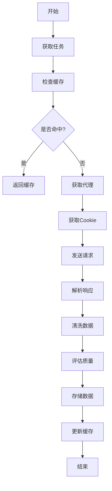
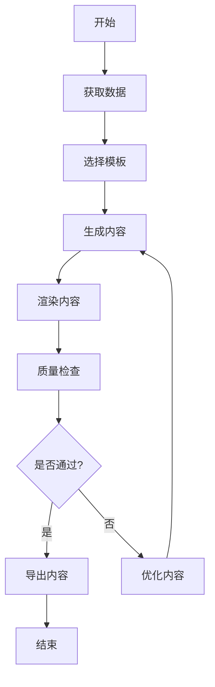

# 架构文档

## 系统架构

### 1. 整体架构

```
                                    [负载均衡]
                                         |
                                    [API网关]
                                         |
                    +------------------+------------------+
                    |                  |                  |
               [爬虫系统]         [处理系统]         [生成系统]
                    |                  |                  |
              +-----+-----+      +-----+-----+      +----+----+
              |           |      |           |      |         |
         [代理管理]   [Cookie管理] [数据清洗]  [质量评估] [模板系统] [渲染系统]
              |           |      |           |      |         |
              v           v      v           v      v         v
         [代理池]     [Cookie池] [清洗规则]  [评估模型] [模板库]  [渲染引擎]
```

### 2. 核心组件

#### 2.1 爬虫系统
- 基础爬虫框架
- 代理管理系统
- Cookie管理系统
- 请求调度系统
- 异常处理系统

#### 2.2 处理系统
- 数据清洗模块
- 质量评估模块
- 内容分类模块
- 标签管理模块
- 数据存储模块

#### 2.3 生成系统
- 模板管理模块
- 内容生成模块
- 渲染引擎模块
- 导出适配模块
- 质量控制模块

## 技术栈

### 1. 后端技术

#### 1.1 核心框架
- Python 3.8+
- FastAPI
- SQLAlchemy
- Celery
- Redis
- PostgreSQL

#### 1.2 爬虫相关
- aiohttp
- beautifulsoup4
- selenium
- playwright
- scrapy

#### 1.3 数据处理
- pandas
- numpy
- scikit-learn
- nltk
- spacy

#### 1.4 监控告警
- prometheus
- grafana
- alertmanager
- statsd

### 2. 存储方案

#### 2.1 关系型数据库
- PostgreSQL: 主数据存储
  - 内容数据
  - 用户数据
  - 配置数据
  - 统计数据

#### 2.2 缓存系统
- Redis: 分布式缓存
  - 请求缓存
  - 会话管理
  - 任务队列
  - 计数器

#### 2.3 文件存储
- MinIO: 对象存储
  - 图片存储
  - 视频存储
  - 文档存储
  - 备份存储

## 模块设计

### 1. 爬虫模块

#### 1.1 基础爬虫
```python
class BaseCrawler:
    """基础爬虫类。"""
    
    def __init__(self, config: Dict[str, Any]):
        """初始化爬虫。

        Args:
            config: 爬虫配置
        """
        self.config = config
        self.session = self._create_session()
        self.proxy_manager = ProxyManager()
        self.cookie_manager = CookieManager()
    
    async def fetch(self, url: str) -> Dict[str, Any]:
        """获取数据。

        Args:
            url: 目标URL

        Returns:
            Dict[str, Any]: 响应数据
        """
        pass
    
    async def parse(self, response: Dict[str, Any]) -> Dict[str, Any]:
        """解析数据。

        Args:
            response: 响应数据

        Returns:
            Dict[str, Any]: 解析结果
        """
        pass
```

#### 1.2 代理管理
```python
class ProxyManager:
    """代理管理器。"""
    
    def __init__(self):
        """初始化代理管理器。"""
        self.proxies = []
        self.scores = {}
    
    async def get_proxy(self) -> str:
        """获取代理。

        Returns:
            str: 代理地址
        """
        pass
    
    async def update_score(self, proxy: str, score: float):
        """更新代理分数。

        Args:
            proxy: 代理地址
            score: 新分数
        """
        pass
```

#### 1.3 Cookie管理
```python
class CookieManager:
    """Cookie管理器。"""
    
    def __init__(self):
        """初始化Cookie管理器。"""
        self.cookies = []
        self.scores = {}
    
    async def get_cookie(self) -> Dict[str, str]:
        """获取Cookie。

        Returns:
            Dict[str, str]: Cookie数据
        """
        pass
    
    async def update_score(self, cookie: Dict[str, str], score: float):
        """更新Cookie分数。

        Args:
            cookie: Cookie数据
            score: 新分数
        """
        pass
```

### 2. 处理模块

#### 2.1 数据清洗
```python
class DataCleaner:
    """数据清洗器。"""
    
    def __init__(self, rules: List[Dict[str, Any]]):
        """初始化清洗器。

        Args:
            rules: 清洗规则
        """
        self.rules = rules
    
    def clean(self, data: Dict[str, Any]) -> Dict[str, Any]:
        """清洗数据。

        Args:
            data: 原始数据

        Returns:
            Dict[str, Any]: 清洗后的数据
        """
        pass
```

#### 2.2 质量评估
```python
class QualityEvaluator:
    """质量评估器。"""
    
    def __init__(self, model_path: str):
        """初始化评估器。

        Args:
            model_path: 模型路径
        """
        self.model = self._load_model(model_path)
    
    def evaluate(self, content: Dict[str, Any]) -> float:
        """评估内容质量。

        Args:
            content: 内容数据

        Returns:
            float: 质量分数
        """
        pass
```

### 3. 生成模块

#### 3.1 模板管理
```python
class TemplateManager:
    """模板管理器。"""
    
    def __init__(self, template_dir: str):
        """初始化模板管理器。

        Args:
            template_dir: 模板目录
        """
        self.templates = self._load_templates(template_dir)
    
    def get_template(self, name: str) -> Template:
        """获取模板。

        Args:
            name: 模板名称

        Returns:
            Template: 模板对象
        """
        pass
```

#### 3.2 内容生成
```python
class ContentGenerator:
    """内容生成器。"""
    
    def __init__(self, template_manager: TemplateManager):
        """初始化生成器。

        Args:
            template_manager: 模板管理器
        """
        self.template_manager = template_manager
    
    async def generate(self, data: Dict[str, Any], template: str) -> Dict[str, Any]:
        """生成内容。

        Args:
            data: 源数据
            template: 模板名称

        Returns:
            Dict[str, Any]: 生成的内容
        """
        pass
```

## 数据流

### 1. 爬虫流程


### 2. 生成流程


## 部署架构

### 1. 开发环境
```
[开发机]
  |-- Docker
       |-- PostgreSQL
       |-- Redis
       |-- MinIO
```

### 2. 测试环境
```
[测试服务器]
  |-- Docker Compose
       |-- API服务
       |-- 爬虫服务
       |-- 生成服务
       |-- PostgreSQL
       |-- Redis
       |-- MinIO
       |-- Prometheus
       |-- Grafana
```

### 3. 生产环境
```
[负载均衡]
    |
    |-- [API服务器集群]
    |       |-- API服务 x N
    |
    |-- [爬虫服务器集群]
    |       |-- 爬虫服务 x N
    |
    |-- [生成服务器集群]
    |       |-- 生成服务 x N
    |
    |-- [数据库集群]
    |       |-- PostgreSQL Master
    |       |-- PostgreSQL Slave x 2
    |
    |-- [缓存集群]
    |       |-- Redis Master
    |       |-- Redis Slave x 2
    |
    |-- [对象存储集群]
    |       |-- MinIO x 4
    |
    |-- [监控系统]
            |-- Prometheus
            |-- Grafana
            |-- Alertmanager
```

## 安全设计

### 1. 身份认证
- JWT认证
- API密钥认证
- OAuth2集成
- 会话管理

### 2. 访问控制
- RBAC权限模型
- API访问限制
- IP白名单
- 资源隔离

### 3. 数据安全
- 数据加密
- 敏感信息脱敏
- 备份策略
- 审计日志

### 4. 网络安全
- HTTPS加密
- WAF防护
- DDoS防护
- 漏洞扫描

## 扩展性设计

### 1. 水平扩展
- 服务无状态
- 负载均衡
- 分片部署
- 自动扩缩容

### 2. 垂直扩展
- 资源优化
- 性能调优
- 并发处理
- 异步处理

### 3. 功能扩展
- 插件系统
- 钩子机制
- 配置中心
- 服务发现

## 监控设计

### 1. 系统监控
- 资源使用
- 服务状态
- 性能指标
- 错误日志

### 2. 业务监控
- 爬虫指标
- 生成指标
- 质量指标
- 转化指标

### 3. 告警系统
- 告警规则
- 通知渠道
- 告警级别
- 告警抑制 