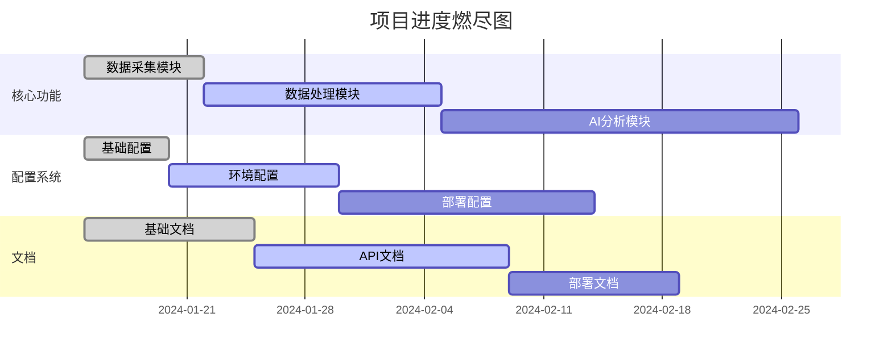

# 项目进度追踪

## 燃尽图统计
- 开始日期：2024-02-05
- 预计完成日期：2024-03-05
- 总任务点数：100
- 已完成点数：40
- 剩余点数：60

## 模块问题追踪

### 1. 爬虫引擎 (ID: ENGINE)
#### 待解决问题
- [ ] ENGINE-001: 实现分布式任务调度 (优先级：高)
- [ ] ENGINE-002: 添加请求限速功能 (优先级：中)
- [ ] ENGINE-003: 完善错误重试机制 (优先级：中)
- [ ] ENGINE-004: 实现数据持久化 (优先级：高)
- [ ] ENGINE-007: 实现多平台爬虫适配 (优先级：高)
- [ ] ENGINE-008: 添加反爬策略 (优先级：高)

#### 已解决问题
- [x] ENGINE-005: 基础爬虫引擎框架搭建 (2024-02-04)
- [x] ENGINE-006: HTTP请求模块实现 (2024-02-03)
- [x] ENGINE-009: Cookie管理实现 (2024-02-05)
- [x] ENGINE-010: 代理池管理实现 (2024-02-05)

### 2. 数据库模块 (ID: DB)
#### 待解决问题
- [ ] DB-001: 实现数据库连接池 (优先级：高)
- [ ] DB-002: 添加数据库迁移脚本 (优先级：中)
- [ ] DB-003: 优化查询性能 (优先级：低)
- [ ] DB-006: 实现数据备份策略 (优先级：中)
- [ ] DB-007: 添加数据清理机制 (优先级：低)

#### 已解决问题
- [x] DB-004: 基础数据模型设计 (2024-02-04)
- [x] DB-005: 异步数据库操作支持 (2024-02-03)
- [x] DB-008: 实现多存储引擎支持 (2024-02-05)
- [x] DB-009: 完成基础DAO层实现 (2024-02-05)

### 3. API服务 (ID: API)
#### 待解决问题
- [ ] API-001: 实现用户认证 (优先级：高)
- [ ] API-002: 添加请求速率限制 (优先级：中)
- [ ] API-003: API文档自动生成 (优先级：中)
- [ ] API-006: 实现WebSocket支持 (优先级：低)
- [ ] API-007: 添加缓存层 (优先级：中)

#### 已解决问题
- [x] API-004: 基础API框架搭建 (2024-02-05)
- [x] API-005: 健康检查接口实现 (2024-02-05)
- [x] API-008: 爬虫控制接口实现 (2024-02-05)
- [x] API-009: 告警接口实现 (2024-02-05)

### 4. 前端界面 (ID: UI)
#### 待解决问题
- [ ] UI-001: 实现任务管理界面 (优先级：高)
- [ ] UI-002: 添加数据可视化 (优先级：中)
- [ ] UI-003: 优化移动端适配 (优先级：低)
- [ ] UI-006: 实现实时数据更新 (优先级：中)
- [ ] UI-007: 添加主题切换功能 (优先级：低)

#### 已解决问题
- [x] UI-004: 基础界面框架搭建 (2024-02-04)
- [x] UI-005: 登录界面实现 (2024-02-03)
- [x] UI-008: 路由配置完成 (2024-02-05)
- [x] UI-009: 基础组件库集成 (2024-02-05)

### 5. 工具类模块 (ID: UTIL)
#### 待解决问题
- [ ] UTIL-001: 优化代理池性能 (优先级：高)
- [ ] UTIL-002: 完善限速器配置 (优先级：中)
- [ ] UTIL-003: 增强断路器功能 (优先级：中)
- [ ] UTIL-004: 优化缓存策略 (优先级：高)
- [ ] UTIL-005: 改进错误处理机制 (优先级：中)
- [ ] UTIL-006: 完善任务队列管理 (优先级：高)

#### 已解决问题
- [x] UTIL-007: 实现基础代理管理 (2024-02-05)
- [x] UTIL-008: 完成Cookie管理系统 (2024-02-05)
- [x] UTIL-009: 实现请求头管理 (2024-02-05)
- [x] UTIL-010: 基础重试机制实现 (2024-02-04)

### 6. 测试套件 (ID: TEST)
#### 待解决问题
- [ ] TEST-001: 补充单元测试覆盖 (优先级：高)
- [ ] TEST-002: 完善集成测试 (优先级：中)
- [ ] TEST-003: 添加性能测试基准 (优先级：中)
- [ ] TEST-004: 实现压力测试方案 (优先级：高)
- [ ] TEST-005: 优化测试数据生成 (优先级：低)
- [ ] TEST-006: 改进测试报告生成 (优先级：低)

#### 已解决问题
- [x] TEST-007: 搭建基础测试框架 (2024-02-04)
- [x] TEST-008: 实现测试用例管理 (2024-02-04)
- [x] TEST-009: 完成监控测试模块 (2024-02-05)
- [x] TEST-010: 基础性能测试实现 (2024-02-05)

### 7. 部署模块 (ID: DEPLOY)
#### 待解决问题
- [ ] DEPLOY-001: 完善Docker编排配置 (优先级：高)
- [ ] DEPLOY-002: 优化服务发现机制 (优先级：中)
- [ ] DEPLOY-003: 改进日志收集系统 (优先级：中)
- [ ] DEPLOY-004: 实现自动化部署 (优先级：高)
- [ ] DEPLOY-005: 完善监控告警 (优先级：中)
- [ ] DEPLOY-006: 优化负载均衡 (优先级：中)

#### 已解决问题
- [x] DEPLOY-007: 基础Docker配置 (2024-02-05)
- [x] DEPLOY-008: Nginx反向代理配置 (2024-02-05)
- [x] DEPLOY-009: Grafana面板搭建 (2024-02-05)
- [x] DEPLOY-010: Prometheus集成 (2024-02-05)

### 8. 监控模块 (ID: MONITOR)
#### 待解决问题
- [ ] MONITOR-001: 完善告警规则引擎 (优先级：高)
- [ ] MONITOR-002: 优化指标收集性能 (优先级：中)
- [ ] MONITOR-003: 实现告警聚合功能 (优先级：中)
- [ ] MONITOR-004: 添加自定义监控面板 (优先级：高)
- [ ] MONITOR-005: 改进通知分发机制 (优先级：中)
- [ ] MONITOR-006: 实现监控数据存储 (优先级：高)

#### 已解决问题
- [x] MONITOR-007: 基础监控框架搭建 (2024-02-05)
- [x] MONITOR-008: 爬虫监控实现 (2024-02-05)
- [x] MONITOR-009: 告警基础功能 (2024-02-05)
- [x] MONITOR-010: 指标收集系统 (2024-02-05)

### 9. 处理器模块 (ID: PROCESSOR)
#### 待解决问题
- [ ] PROCESSOR-001: 实现通用内容分析 (优先级：高)
- [ ] PROCESSOR-002: 优化处理性能 (优先级：中)
- [ ] PROCESSOR-003: 添加数据验证 (优先级：中)
- [ ] PROCESSOR-004: 实现批量处理 (优先级：高)
- [ ] PROCESSOR-005: 支持自定义处理器 (优先级：中)
- [ ] PROCESSOR-006: 添加处理管道 (优先级：高)

#### 已解决问题
- [x] PROCESSOR-007: 基础处理器框架 (2024-02-05)
- [x] PROCESSOR-008: 小红书数据处理 (2024-02-05)
- [x] PROCESSOR-009: 内容生成器实现 (2024-02-05)
- [x] PROCESSOR-010: 内容摘要功能 (2024-02-05)

### 10. 调度器模块 (ID: SCHEDULER)
#### 待解决问题
- [ ] SCHEDULER-001: 实现分布式调度 (优先级：高)
- [ ] SCHEDULER-002: 添加任务优先级 (优先级：中)
- [ ] SCHEDULER-003: 实现失败重试 (优先级：中)
- [ ] SCHEDULER-004: 添加任务依赖 (优先级：高)
- [ ] SCHEDULER-005: 优化调度算法 (优先级：中)
- [ ] SCHEDULER-006: 实现动态调度 (优先级：高)

#### 已解决问题
- [x] SCHEDULER-007: 基础调度框架 (2024-02-05)
- [x] SCHEDULER-008: 爬虫任务调度 (2024-02-05)
- [x] SCHEDULER-009: 调度器测试 (2024-02-05)
- [x] SCHEDULER-010: 基础队列实现 (2024-02-05)

### 11. 模型模块 (ID: MODEL)
#### 待解决问题
- [ ] MODEL-001: 优化数据结构 (优先级：高)
- [ ] MODEL-002: 添加字段验证 (优先级：中)
- [ ] MODEL-003: 实现模型关联 (优先级：中)
- [ ] MODEL-004: 优化查询性能 (优先级：高)
- [ ] MODEL-005: 添加缓存支持 (优先级：中)
- [ ] MODEL-006: 实现版本控制 (优先级：高)

#### 已解决问题
- [x] MODEL-007: 基础模型定义 (2024-02-05)
- [x] MODEL-008: 数据表映射 (2024-02-05)
- [x] MODEL-009: 枚举类型支持 (2024-02-05)
- [x] MODEL-010: 监控模型实现 (2024-02-05)

### 12. 缓存模块 (ID: CACHE)
#### 待解决问题
- [ ] CACHE-001: 优化缓存策略 (优先级：高)
- [ ] CACHE-002: 实现分布式缓存 (优先级：中)
- [ ] CACHE-003: 添加缓存预热 (优先级：中)
- [ ] CACHE-004: 实现缓存同步 (优先级：高)
- [ ] CACHE-005: 优化内存使用 (优先级：中)
- [ ] CACHE-006: 添加缓存监控 (优先级：高)

#### 已解决问题
- [x] CACHE-007: 基础缓存框架 (2024-02-05)
- [x] CACHE-008: Redis缓存实现 (2024-02-05)
- [x] CACHE-009: 本地缓存支持 (2024-02-05)
- [x] CACHE-010: 缓存管理器实现 (2024-02-05)

### 13. 导出模块 (ID: EXPORT)
#### 待解决问题
- [ ] EXPORT-001: 支持更多格式 (优先级：高)
- [ ] EXPORT-002: 优化导出性能 (优先级：中)
- [ ] EXPORT-003: 添加导出进度 (优先级：中)
- [ ] EXPORT-004: 实现批量导出 (优先级：高)
- [ ] EXPORT-005: 支持自定义模板 (优先级：中)
- [ ] EXPORT-006: 添加导出验证 (优先级：高)

#### 已解决问题
- [x] EXPORT-007: 基础导出框架 (2024-02-05)
- [x] EXPORT-008: HTML导出支持 (2024-02-05)
- [x] EXPORT-009: 导出基类实现 (2024-02-05)
- [x] EXPORT-010: 基础模板支持 (2024-02-05)

### 14. Web服务 (ID: WEB)
#### 待解决问题
- [ ] WEB-001: 完善路由系统 (优先级：高)
- [ ] WEB-002: 优化中间件 (优先级：中)
- [ ] WEB-003: 增强认证功能 (优先级：中)
- [ ] WEB-004: 改进模板系统 (优先级：高)
- [ ] WEB-005: 添加会话管理 (优先级：中)
- [ ] WEB-006: 实现权限控制 (优先级：高)

#### 已解决问题
- [x] WEB-007: 基础Web框架 (2024-02-05)
- [x] WEB-008: 路由系统实现 (2024-02-05)
- [x] WEB-009: 基础认证功能 (2024-02-05)
- [x] WEB-010: 模板系统集成 (2024-02-05)

### 15. 主题模块 (ID: THEME)
#### 待解决问题
- [ ] THEME-001: 支持主题切换 (优先级：高)
- [ ] THEME-002: 优化主题性能 (优先级：中)
- [ ] THEME-003: 添加主题预览 (优先级：中)
- [ ] THEME-004: 实现主题定制 (优先级：高)
- [ ] THEME-005: 支持动态主题 (优先级：中)
- [ ] THEME-006: 添加主题验证 (优先级：高)

#### 已解决问题
- [x] THEME-007: 基础主题框架 (2024-02-05)
- [x] THEME-008: 默认主题实现 (2024-02-05)
- [x] THEME-009: 主题格式化器 (2024-02-05)
- [x] THEME-010: 主题管理系统 (2024-02-05)

### 16. CLI工具 (ID: CLI)
#### 待解决问题
- [ ] CLI-001: 完善命令行参数 (优先级：高)
- [ ] CLI-002: 添加交互模式 (优先级：中)
- [ ] CLI-003: 实现配置管理 (优先级：中)
- [ ] CLI-004: 添加进度显示 (优先级：高)
- [ ] CLI-005: 优化错误处理 (优先级：中)
- [ ] CLI-006: 实现日志记录 (优先级：高)

#### 已解决问题
- [x] CLI-007: 基础命令行框架 (2024-02-05)
- [x] CLI-008: 基本命令实现 (2024-02-05)
- [x] CLI-009: 配置文件支持 (2024-02-05)
- [x] CLI-010: 帮助信息显示 (2024-02-05)

### 17. Web组件 (ID: WEBCOMP)
#### 待解决问题
- [ ] WEBCOMP-001: 完善限速中间件 (优先级：高)
- [ ] WEBCOMP-002: 增强JWT认证 (优先级：中)
- [ ] WEBCOMP-003: 优化监控路由 (优先级：中)
- [ ] WEBCOMP-004: 改进模板系统 (优先级：高)
- [ ] WEBCOMP-005: 添加错误页面 (优先级：中)
- [ ] WEBCOMP-006: 实现缓存机制 (优先级：高)

#### 已解决问题
- [x] WEBCOMP-007: 基础中间件实现 (2024-02-05)
- [x] WEBCOMP-008: JWT认证集成 (2024-02-05)
- [x] WEBCOMP-009: 监控路由实现 (2024-02-05)
- [x] WEBCOMP-010: 基础模板系统 (2024-02-05)

## 当前迭代进度
### Sprint 1 (2024-02-01 至 2024-02-15)
- 目标点数：30
- 已完成点数：20
- 剩余点数：10
- 燃尽状态：提前

#### 关键里程碑
1. [x] 项目基础架构搭建
2. [x] 数据库基础功能实现
3. [x] API基础功能实现
4. [ ] 前端基础界面完成

## 风险追踪
1. 🔴 分布式任务调度的复杂性可能影响开发进度
2. 🟡 数据库性能优化需要更多测试数据
3. 🟡 多平台爬虫适配工作量大
4. 🟢 前端界面需求可能发生变更
5. 🟡 测试覆盖率需要提升
6. 🟡 部署自动化有待完善
7. 🟡 监控系统的可扩展性需要验证
8. 🟡 处理器的性能需要优化
9. 🔴 调度器的可靠性需要加强
10. 🟡 模型设计需要优化
11. 🟡 缓存系统需要优化
12. 🟡 导出功能需要完善
13. 🟡 Web服务的安全性需要加强
14. 🟢 主题系统的扩展性良好
15. 🟡 CLI工具的用户体验需要改进
16. 🟡 Web组件的性能需要优化

## 下一步计划
1. 完成API认证模块
2. 实现基础任务调度
3. 优化数据库连接池
4. 完善前端界面交互
5. 实现多平台爬虫适配
6. 添加数据可视化功能
7. 补充单元测试用例
8. 完善部署配置
9. 完善监控告警系统
10. 优化数据处理性能
11. 实现分布式调度
12. 优化数据模型设计
13. 优化缓存策略
14. 完善导出功能
15. 加强Web服务安全性
16. 实现主题切换功能
17. 完善命令行工具
18. 优化Web组件性能

## 新增任务 (2024-02-03)

### GitHub配置完善
- [ ] 完善GitHub Actions工作流配置
- [ ] 补充Issue和PR模板内容
- [ ] 审查并更新依赖配置
- [ ] 完善社区文档

### 开发环境配置
- [ ] 优化devcontainer配置
- [ ] 完善VSCode工作区设置

### 部署配置优化
- [ ] 配置Grafana仪表盘
- [ ] 设置Prometheus监控规则
- [ ] 优化Nginx配置

### AI功能增强
- [ ] 完善分析器提示词配置
- [ ] 添加更多AI功能模块

## 燃尽图更新

